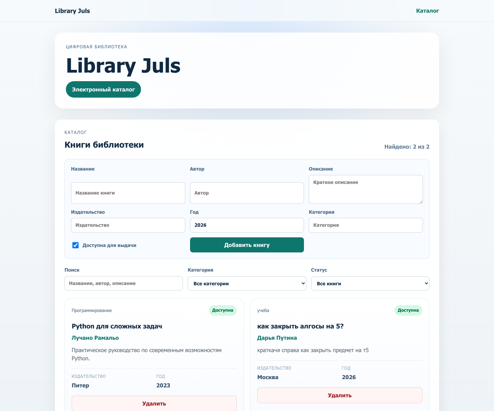

# Library Juls

Репозиторий для прототипа электронной библиотеки: frontend на Vue 3 + Vite, backend на FastAPI, запуск через Docker Compose.

Автор: ФИО  
Группа: номер группы  
Дата: дата выполнения

## Цель работы

Создать прототип SPA-приложения электронной библиотеки на Vue 3 с использованием Vite, реализовать backend на FastAPI и подготовить запуск проекта через Docker.

## Структура проекта

```text
/
├── frontend/
│   ├── src/
│   │   ├── components/
│   │   │   ├── AppFooter.vue
│   │   │   ├── AppHeader.vue
│   │   │   ├── BookItem.vue
│   │   │   └── BookList.vue
│   │   ├── App.vue
│   │   └── main.js
│   ├── public/
│   ├── Dockerfile
│   ├── index.html
│   ├── nginx.conf
│   ├── package.json
│   └── vite.config.js
├── backend/
│   ├── Dockerfile
│   ├── main.py
│   └── requirements.txt
├── data/
│   └── books.json
├── docs/
│   └── imgs/
├── docker-compose.yml
└── README.md
```

## Выполненные шаги

- создан Vue 3 проект через Vite
- настроен `vite.config.js`
- собран frontend через `npm run build`
- создан Dockerfile для frontend
- создан FastAPI backend
- реализованы GET, POST и DELETE роуты
- добавлены моковые данные
- создан `docker-compose.yml`
- добавлены добавление, удаление и фильтрация книг на frontend

## Скриншот



## API

### GET /api/books

Возвращает список книг из файла `data/books.json`.

### POST /api/books

Добавляет новую книгу в список и сохраняет обновленный массив в `data/books.json`.

### DELETE /api/books/{book_id}

Удаляет книгу по идентификатору.

### GET /api/health

Возвращает статус доступности сервера.

## Инструкция запуска

### Для frontend в режиме разработки

```bash
cd frontend
npm install
npm run dev
```

### Для сборки

```bash
npm run build
```

### Для backend

```bash
cd backend
pip install -r requirements.txt
uvicorn main:app --reload --port 8000
```

### Для Docker

```bash
docker compose build
docker compose up
```

## Вывод

В результате была создана базовая структура приложения ElectoLibrary, настроены frontend на Vue 3 и backend на FastAPI, добавлены моковые данные и подготовлена контейнеризация через Docker Compose.
