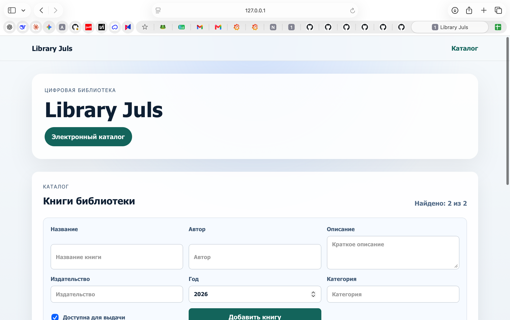
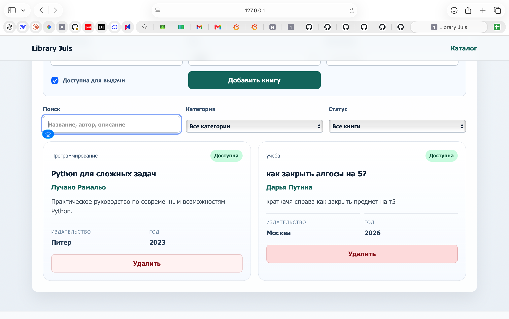

# Library Juls

Прототип SPA-приложения электронной библиотеки с frontend на Vue 3 + Vite и backend на FastAPI.

**Авторы:** Рыбаков Я.В., Смирнова Ю.Е.  
**Группа:** P3269  
**Дата выполнения:** 29.05.2026  
**Репозиторий:** <https://github.com/pistaha/libraryJuls>

## Цель работы

Создать прототип приложения электронной библиотеки, подготовить frontend-составляющую на Vite, реализовать backend с несколькими API-роутами, добавить моковые данные и настроить запуск через Docker.

## Что реализовано

- создан SPA frontend на `Vue 3` и `Vite`
- настроена сборка frontend через `npm run build`
- добавлен Dockerfile для frontend и nginx-конфигурация
- реализован backend на `FastAPI`
- добавлены API-роуты `GET`, `POST`, `DELETE`
- подключены моковые данные книг из `data/books.json`
- реализовано добавление книг через форму
- реализовано удаление книг из каталога
- добавлена фильтрация по поиску, категории и статусу доступности
- подготовлен общий запуск через `docker-compose.yml`

## Основные шаги выполнения

1. Создан frontend-проект с помощью `npm create vite@latest`.
2. Выбрана связка `Vue 3 + Vite` для реализации SPA-интерфейса электронной библиотеки.
3. Настроена структура frontend-приложения: основной экран, шапка, футер, список книг и карточка книги.
4. Добавлена форма управления каталогом: ввод названия, автора, описания, издательства, года, категории и статуса доступности.
5. Реализована фильтрация книг по поисковой строке, категории и статусу доступности.
6. Настроен `vite.config.js`: задан порт dev-сервера и проксирование `/api` на backend.
7. Выполнена проверка production-сборки frontend командой `npm run build`.
8. Создан frontend-контейнер на основе `Dockerfile`: сборка приложения выполняется в Node.js, готовые статические файлы отдаются через nginx.
9. Добавлен `nginx.conf` для отдачи SPA и проксирования API-запросов на backend-контейнер.
10. Реализован backend-сервер на FastAPI.
11. Добавлены API-роуты для проверки сервера, получения списка книг, добавления книги и удаления книги.
12. Подготовлены моковые данные каталога в файле `data/books.json`.
13. Настроен `docker-compose.yml` для совместного запуска frontend и backend.
14. Сделаны скриншоты локально запущенного приложения и добавлены в `docs/imgs`.
15. Подготовлен отчет в `README.md` со структурой проекта, командами запуска, API и проверками.
16. Проект опубликован в отдельном GitHub-репозитории.

## Структура проекта

```text
libraryJuls/
├── backend/
│   ├── Dockerfile
│   ├── main.py
│   └── requirements.txt
├── data/
│   └── books.json
├── docs/
│   └── imgs/
│       ├── app-catalog.png
│       └── app-actions.png
├── frontend/
│   ├── src/
│   │   ├── components/
│   │   │   ├── AppFooter.vue
│   │   │   ├── AppHeader.vue
│   │   │   ├── BookItem.vue
│   │   │   └── BookList.vue
│   │   ├── App.vue
│   │   └── main.js
│   ├── Dockerfile
│   ├── index.html
│   ├── nginx.conf
│   ├── package.json
│   └── vite.config.js
├── docker-compose.yml
└── README.md
```

## Скриншоты приложения

Скриншоты запущенного приложения через `npm run dev`:





## Frontend

Frontend расположен в папке `frontend`.

Основные команды:

```bash
cd frontend
npm install
npm run dev
```

Сборка production-версии:

```bash
cd frontend
npm run build
```

После запуска dev-сервера приложение доступно по адресу:

```text
http://127.0.0.1:3000/
```

Vite настроен так, чтобы запросы `/api` проксировались на backend:

```text
http://127.0.0.1:8000
```

## Backend

Backend расположен в папке `backend` и реализован на FastAPI.

Запуск локально:

```bash
cd backend
pip install -r requirements.txt
uvicorn main:app --reload --port 8000
```

После запуска API доступно по адресу:

```text
http://127.0.0.1:8000
```

## API

| Метод | Роут | Назначение |
| --- | --- | --- |
| `GET` | `/api/health` | Проверка доступности backend |
| `GET` | `/api/books` | Получение списка книг |
| `POST` | `/api/books` | Добавление новой книги |
| `DELETE` | `/api/books/{book_id}` | Удаление книги по идентификатору |

Пример тела запроса для добавления книги:

```json
{
  "title": "Название книги",
  "author": "Автор",
  "description": "Описание книги",
  "publisher": "Издательство",
  "year": 2026,
  "category": "Категория",
  "available": true
}
```

Команды для проверки API:

```bash
curl http://127.0.0.1:8000/api/health
```

```bash
curl http://127.0.0.1:8000/api/books
```

```bash
curl -X POST http://127.0.0.1:8000/api/books \
  -H "Content-Type: application/json" \
  -d '{
    "title": "Тестовая книга",
    "author": "Тестовый автор",
    "description": "Описание для проверки POST-запроса",
    "publisher": "Library Juls",
    "year": 2026,
    "category": "Тест",
    "available": true
  }'
```

```bash
curl -X DELETE http://127.0.0.1:8000/api/books/1
```

## Моковые данные

Данные каталога находятся в файле:

```text
data/books.json
```

Для каждой книги используются поля:

- `id`
- `title`
- `author`
- `description`
- `publisher`
- `year`
- `category`
- `available`
- `created_at`

## Docker

Для запуска всего приложения через Docker Compose:

```bash
docker compose build
docker compose up
```

После запуска контейнеров:

```text
Frontend: http://localhost:3000
Backend:  http://localhost:8000
```

`frontend/nginx.conf` проксирует запросы `/api/` во внутренний backend-сервис Docker Compose.

## Проверка выполнения

В рамках работы выполнены основные пункты задания:

- проект создан на основе Vite
- frontend собирается командой `npm run build`
- frontend запускается командой `npm run dev`
- добавлен Dockerfile для frontend
- настроена nginx-конфигурация для frontend-контейнера
- реализован backend-сервер FastAPI
- реализованы API-роуты для получения, добавления и удаления книг
- добавлены моковые данные
- подготовлен screenshot в `docs/imgs`
- проект опубликован в отдельном GitHub-репозитории

## Вывод

В результате был подготовлен прототип приложения Library Juls: электронный каталог книг с просмотром списка, добавлением, удалением и фильтрацией записей. Проект разделен на frontend и backend, поддерживает локальный запуск и контейнеризацию через Docker Compose.
